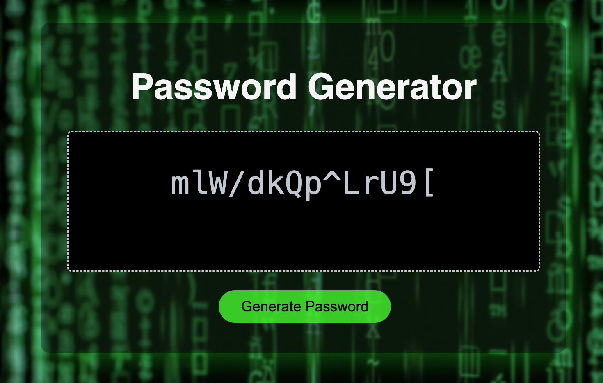

# Password Generator - automate your password generation!
## User Story

Generate a password when the button is clicked.

Present a series of prompts for password criteria:

User would like to generate random passwords that fit the criteria below:

1. A password lenght of at least 8 characters but no more than 128.

2. Include character types determined by user feedback:

- Lowercase

- Uppercase

- Numeric

- Special characters ($@%&*, etc.)

3. Code is validated for each input and at least one character type has been selected.

4. The password prints to the page

### Screen shot
